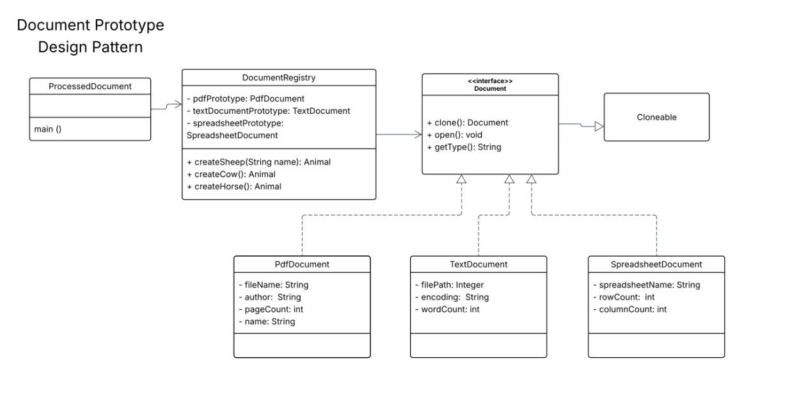

# Document Prototype Design Pattern

A program that demonstrates the Prototype design pattern by creating and opening PDF, Text, and Spreadsheet document objects with their specific properties.

# UML Class Diagram

